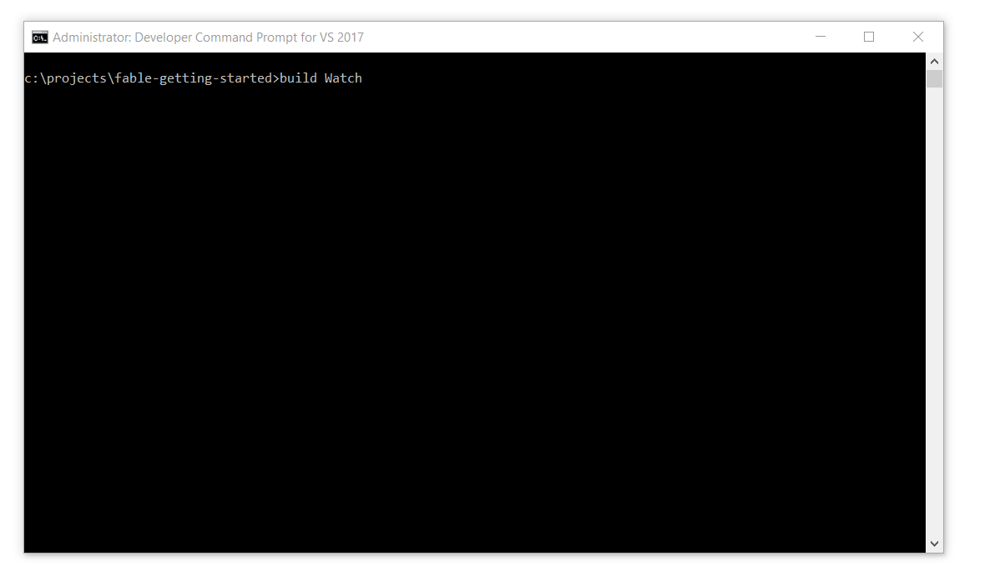

# Watch mode: fast incremental compilation

You cannot help but notice the long compilation time whenever you have to build the project. The very first time you compile the template takes the longest because the project will be fetching all the packages and dependencies it needs before building. Next build naturally takes less time because there is no need to fetch the packages and it takes just the time needed for compiling the project but still, this becomes tedious during development. 

Watch mode to the rescue!

Fable implements what is called "incremental compilation" in watch mode, this means you can start the compilation process and keep it running, the first build takes the usual full-build time and the watch mode is started, now whenever you edit any file Fable recompiles only the parts you changed and it does really fast making it very pleasant for developement. 

To start the watch mode, simply add `Watch` after the build command as follows:

On windows:
```
build Watch
```
On linux or macOs:
```
./build.sh Watch 
```



Now the compilation process has started along with a local developement server that hosts the static content inside the `public` directory. If you navigate to `http://localhost:8080`, the server will return the `index.html` page to your browser. Not only that, if you edit the `App.fs` file and save it, the server quickly recompiles the parts you changed and refreshes the browser page.

From here on now, we will be primarily using the watch mode for developement.